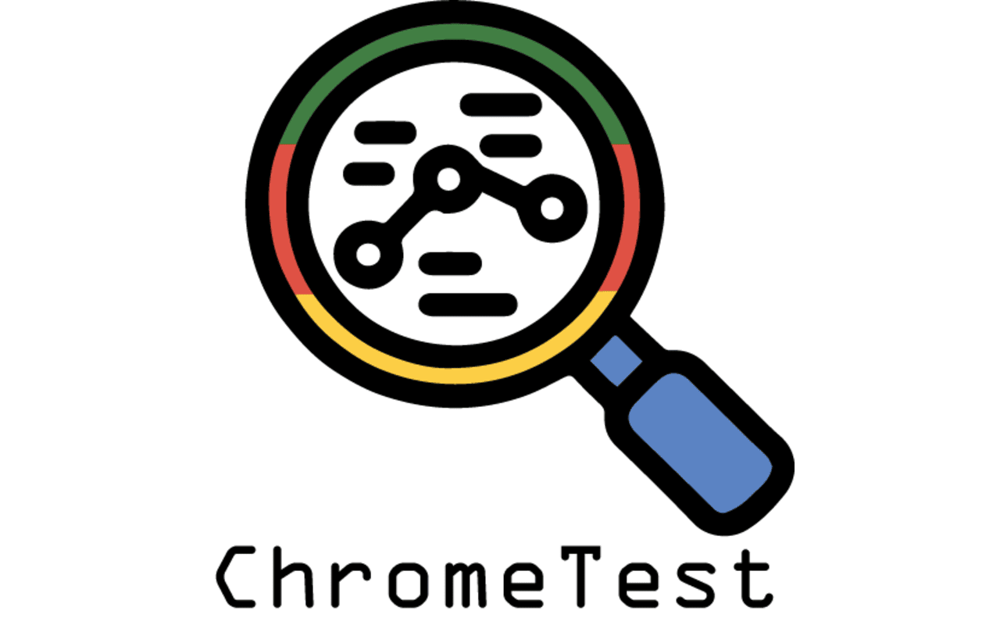

# ChromeTest

ChromeTest is a testing harness for a chrome device where multiple aspects are tested.

     

## Privacy Policy for ChromeTest

### Introduction

Welcome to ChromeTest! This privacy policy explains how we handle your data while using our Chromebook testing application. We prioritize your privacy and are committed to being transparent about how we collect, use, and protect your information.

### Information We Collect

* **Keystroke Logging** : ChromeTest collects keystroke data solely for the purpose of testing keyboard functionality and implementing shortcuts within the app. This logging is done locally on your device and is not transmitted to any server.
* **Device Information** : We may collect basic system information about your Chromebook (such as CPU, memory, storage, and network status) to generate diagnostic reports. This information helps provide accurate test results.

### How We Use Your Data

* **Diagnostic Testing** : The keystroke data and system information we collect are used exclusively for running diagnostics and verifying the functionality of your Chromebook's hardware components.
* **Local Processing Only** : All data collected by ChromeTest is processed locally on your device. We do not store, transmit, or share this data with any third-party services.

### What We Don't Do

* **No User Data Collection** : ChromeTest does not collect, transmit, or store any personally identifiable information (PII) or sensitive user data.
* **No Remote Logging** : We do not remotely log keystrokes or track your activity outside of the testing functions within the app.
* **No Data Sharing** : We do not share or sell any data collected by ChromeTest to third parties.

### User Consent

By using ChromeTest, you agree to the collection of keystroke data strictly for testing and diagnostic purposes. We will always respect your privacy and only gather data necessary for improving your Chromebook's performance and functionality.

### Security

We take the security of your information seriously. Since all data is processed locally on your device, there is minimal risk of unauthorized access or data breaches.

### Changes to this Privacy Policy

We may update this privacy policy from time to time. Any changes will be communicated through the app or our website. We encourage you to review this policy periodically for any updates.

### Description

Overview of the Extension's Development Process
This Chromebook extension is actively under development, with plans for continuous improvement and new feature integration. The extension is designed to gather information about a Chromebook device, package it into a user-friendly format, and present it in an easy-to-read document. The goal is to provide Chromebook users, particularly those who need to assess or troubleshoot their devices, with a comprehensive tool for understanding their Chromebook's specifications and health.

Key Functions of the Extension

Device Information Collection: The extension gathers detailed information on the Chromebook's hardware and software, aiming to provide an accurate snapshot of the device's state.

This includes critical details such as:

CPU and Memory: Information about the processor type, speed, and memory allocation can help users assess the device's capability.

Storage: Details about available and used storage, type of storage (e.g., SSD or eMMC), and remaining space.

Battery Health: Providing battery health metrics like charge cycles, capacity, and real-time charge can help users monitor battery longevity.

OS Version and Updates: Displaying the operating system version and whether any updates are available ensures users are aware of the latest features and security improvements.

System Architecture: Information on system architecture (e.g., ARM or x86) helps identify software compatibility and performance expectations.

Peripherals and Ports: Information about available ports (USB, HDMI, etc.) and connected peripherals, which can be valuable for users working with multiple accessories.

Health Monitoring Features: Chromebook users, especially those with older devices, may benefit from health metrics to ensure their device is running optimally.

 Potential health monitoring features could include:

Temperature Monitoring: For devices with sensors, displaying the temperature of the CPU or battery can help identify overheating issues.

Battery Usage Over Time: Tracking power consumption over time can help users understand battery efficiency, especially useful for assessing whether the battery might need replacement.

Memory and CPU Usage: A snapshot of active CPU and memory usage could assist in identifying background processes or applications that may be consuming excessive resources.

Comprehensive Report Generation: The extension compiles all the gathered information into a structured, easy-to-read report. This report is designed to be accessible to users at all technical levels and provides a clear overview of the Chromebook’s status.

Key features include:

Readable Format: Organizes data in a way that’s intuitive, using categories, subheadings, and explanations for each section.

Export Options: Allowing users to export the report as a PDF or text document for easy sharing with IT support, educators, or other users.

User Interface and Experience: The extension is developed with a focus on user experience, ensuring accessibility and ease of navigation.

The interface design includes:

Dashboard View: A main interface with a dashboard that shows key stats at a glance, such as battery health, storage usage, and CPU load.

Detailed Sections: Each category (e.g., CPU, Memory, Storage) has a dedicated section where users can explore deeper insights.

Tooltips and Help Icons: Tooltips or icons with descriptions help explain more technical terms, making the extension approachable for non-technical users.

Themes and Customization: An option to switch between light and dark themes for readability, along with settings to customize data refresh rates and notifications.

Privacy and Data Security: To maintain user trust, the extension prioritizes data security and transparency. No sensitive information is stored or shared externally, and user data remains private.

Future Development and Updates: Given that this extension will be actively developed, future versions will introduce new functionalities based on user feedback and evolving technology. Some of the planned future features might include:

Device Optimization Suggestions:
Recommendations based on the gathered data (e.g., free up storage, consider replacing the battery, or closing unused applications) for improved performance.

System Alerts: Proactive notifications for potential issues, such as high CPU temperatures, low storage space, or degraded battery health.

Backup and Restore Options: Allow users to back up important system information or settings, aiding in troubleshooting and recovery processes.

Remote Diagnostics: A potential feature for users to share device reports with support teams or administrators for remote troubleshooting.

Practical Use Cases

Education: Teachers and IT administrators in schools often need to manage and troubleshoot multiple Chromebooks. This extension could simplify the process of gathering and assessing Chromebook health, especially in one-to-one computing environments.

Troubleshooting and Support: By generating comprehensive reports, users can easily share relevant information with tech support, potentially reducing the time required to diagnose and fix issues.

Refurbishment and Resale: The extension can be a valuable tool for those looking to refurbish or resell their Chromebooks, as it provides an objective assessment of device health and functionality.

Performance Monitoring for Power Users: Users who rely heavily on Chromebooks for work or intensive tasks can use the extension to monitor system performance and make adjustments as necessary.

Device Longevity Tracking: By tracking health metrics like battery charge cycles and storage usage over time, users can get a better sense of how long their device is likely to last and when a replacement might be necessary.

Technical Considerations for Developers
If you're collaborating with other developers or planning to open-source parts of the project, here are some potential technical challenges and considerations:

Platform Constraints:
 Chrome OS has certain security and privacy restrictions, especially when accessing hardware metrics. Ensuring compliance with Chrome Web Store policies is essential.

API Usage:
Chrome provides a range of APIs that enable information gathering, but they may vary in permissions and capabilities. Leveraging these APIs to their fullest, while maintaining compliance, will be key to the extension’s success.

Data Refresh and Update Frequency:
For real-time monitoring features (e.g., CPU or battery usage), determining an optimal refresh rate is essential to provide accurate, up-to-date information without taxing system resources.

Compatibility Across Chrome OS Versions:
Ensuring compatibility with both older and newer versions of Chrome OS could be challenging but necessary to maximize the extension's reach and usability.

Conclusion:

The Chromebook extension is a versatile tool for anyone looking to understand, maintain, and optimize their Chromebook’s performance. By offering detailed system insights, easy-to-understand documentation, and a user-friendly interface, this extension promises to be a valuable addition for Chromebook users across various fields, from education to IT support and even general consumers.

### Contact Us

If you have any questions or concerns about this privacy policy or how we handle your data, please contact us at infinitdev@proton.me

#Hacktober
